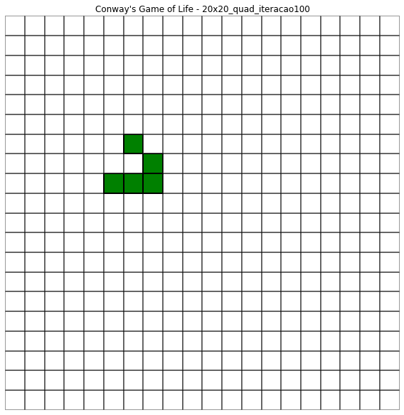
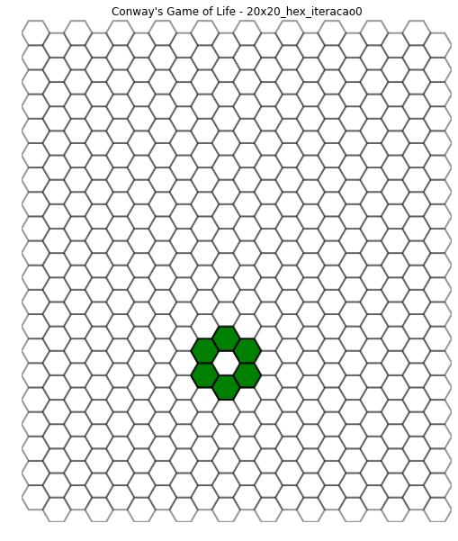
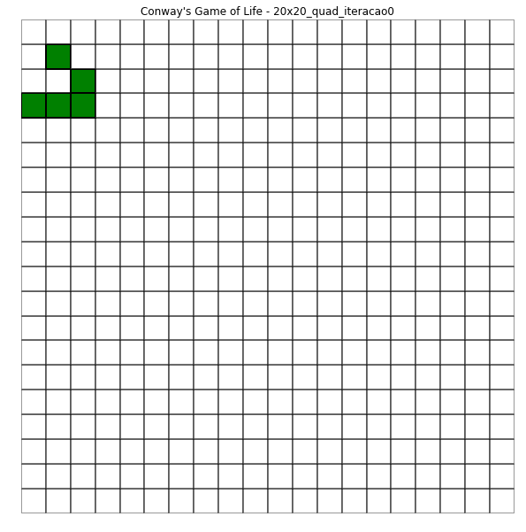
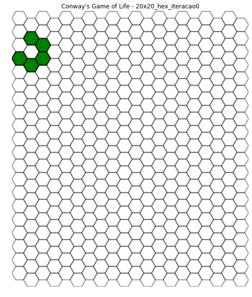
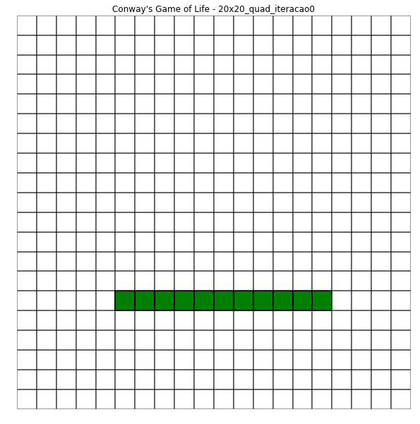
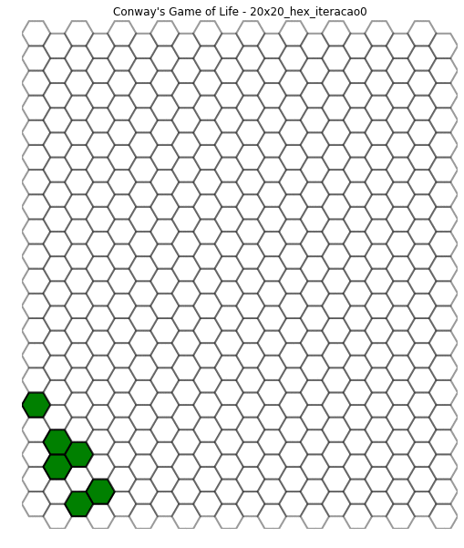

# Conway's Game of Life
### Jogo da Vida - Autômato Celular
2016 | IME-USP | MAC0110 - Introdução à Computação - EP4

O enunciado do programa está no arquivo [ep4.pdf](ep4.pdf).

### Descrição
O Jogo da Vida (Conway's Game of Life) consiste na simulação de um Autômato
Celular. O autômato é composto de uma grade (quadrada ou hexagonal) na qual as
células podem assumir um conjunto de estados e um conjunto de regras para as
mudanças de estado.

Cada célula da grade quadrada possui 8 células vizinhas (células verticalmente,
horizontalmente e diagonalmente adjacentes) e dois estados possíveis: vivo ou
morto. No caso da grade hexagonal, cada célula possui 6 células vizinhas.

A cada iteração, o estado de uma célula pode mudar de acordo com as seguintes regras:
- Uma célula nasce (seu estado muda de morta para viva) se ela possui 3 vizinhas vivas.
- Uma célula viva sobrevive (mantém seu estado de viva) se possui 2 ou 3 vizinhas vivas.
- Nos demais casos as células vivas morrem e as mortas mantém-se mortas.

### Execução
Para executar o programa, abra o terminal na pasta do código fonte e digite:
```bash
$ python ep4.py
```

Com isso, o codigo executará os passos do Jogo da Vida utilizando os valores das
seguintes variáveis da função `main()`:
- `n`: Número de linhas
- `m`: Número de colunas
- `t`: Número de iterações/passos
- `entrada`: Arquivo de entrada (na pasta [inputs/](inputs/) há alguns exemplos)
    - Arquivo de texto com a primeira linha sendo um caractere `Q` para
    identificar grades quadradas ou `H` para identificar grades hexagonais e nas
    demais linhas, dois números inteiros por linha, separados por uma vírgula,
    representando as células vivas.

Exemplo: [inputs/20x20_glider.txt](inputs/20x20_glider.txt)
```
Q
16,0
16,1
16,2
17,2
18,1
```

Ao final da execução, uma imagem `.png` é gerada com um *print* do estado do
autômato após `t` iterações. O nome da imagem possui o seguinte formato:
- `<n>`x`<m>`_`{quad, hex}`_iteracao`<t>`.png

Exemplo: [20x20_quad_iteracao100.png](patterns/20x20_quad_iteracao100.png)



### Demonstração

Para fins ilustrativos, aqui estão algumas animações em `.gif` mostrando a evolução dos
autômatos ao longo das iterações.

- [inputs/20x20_ball.txt](inputs/20x20_ball.txt), 3 iterações




- [inputs/20x20_glider.txt](inputs/20x20_glider.txt), 80 iterações




- [inputs/20x20_gliderHex.txt](inputs/20x20_gliderHex.txt), 8 iterações




- [inputs/20x20_row.txt](inputs/20x20_row.txt), 20 iterações




- [inputs/20x20_testHex.txt](inputs/20x20_testHex.txt), 100 iterações


- [inputs/20x20_testHex2.txt](inputs/20x20_testHex2.txt), 48 iterações


